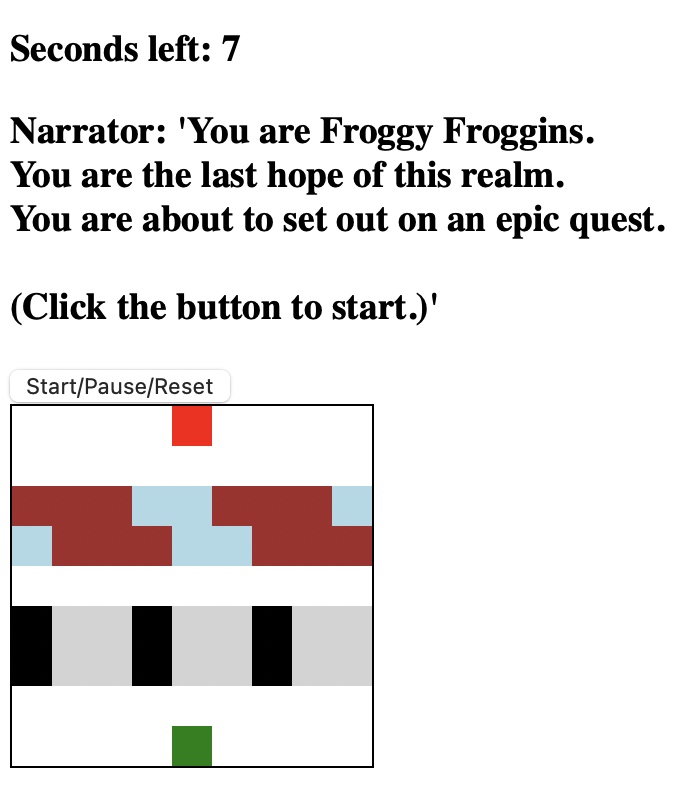
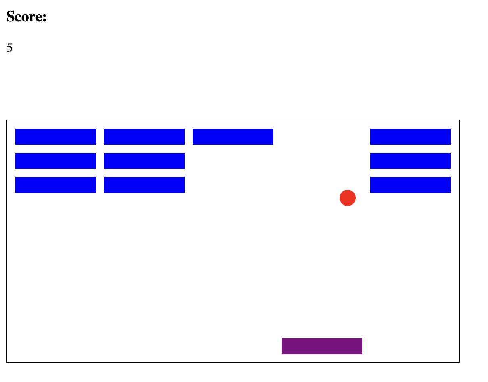
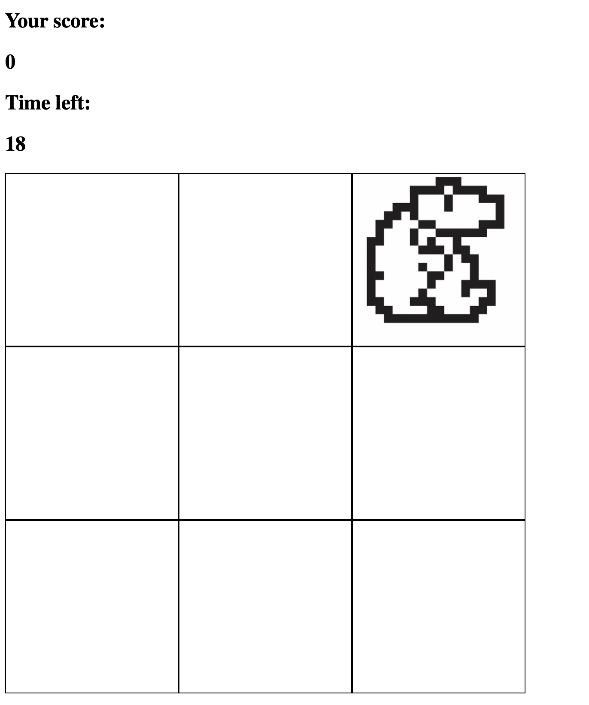

# Descrition: 

4 classic small games intended for the web browser, created with JS, html and css. 

Games: 

- Frogger
- Whack-a-mole
- 2d-Breakout
- Space Invaders

# How to run: 

- Download all files from the folder of the game that you want to play.
- Open the html-file in a web-browser. 

# Additional notes

- Just a fun way of learning to code.
- Based on freeCodeCamp's youtube toturial: https://www.youtube.com/watch?v=ec8vSKJuZTk

# Pictures: 

# Frogger

# 2D-Breakout

# Space Invaders

# Wack-a-mole

